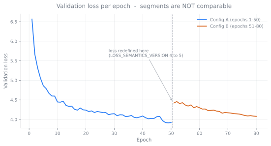
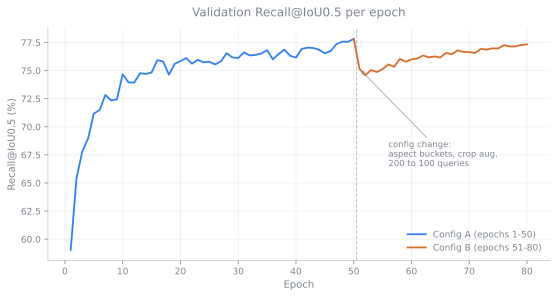
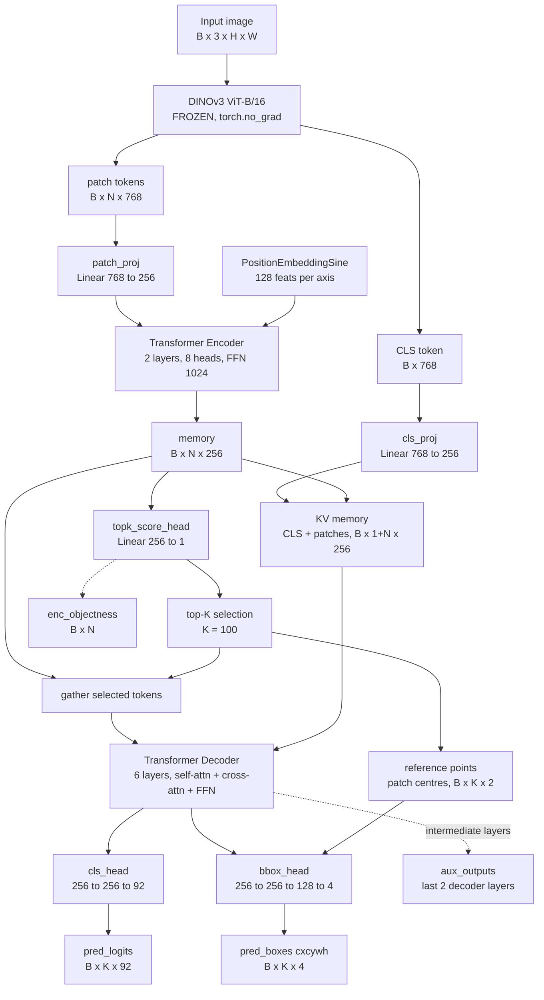

# DINOv3-DETR

A Plain-DETR style object detector built on a **frozen DINOv3 ViT-B/16 backbone**, trained
end-to-end on COCO 2017.

The backbone never updates. Everything that learns — two projection layers, a Transformer
encoder, a query-selection head, a six-layer Transformer decoder and two prediction heads —
is about 30M parameters sitting on top of frozen features. The point of the project is to
find out how much detection performance you can get out of self-supervised ViT features
without ever touching them.

---

## Table of contents

- [Results](#results)
  - [Training curves](#training-curves)
  - [COCO mAP](#coco-map)
- [Architecture](#architecture)
  - [Relation to the official DINOv3 detector](#relation-to-the-official-dinov3-detector)
  - [Data flow](#data-flow)
  - [How the backbone is loaded](#how-the-backbone-is-loaded)
  - [Stage by stage](#stage-by-stage)
  - [Design decisions](#design-decisions)
- [Loss](#loss)
- [Data pipeline](#data-pipeline)
- [Setup](#setup)
- [Training](#training)
- [Resuming a run](#resuming-a-run)
- [Evaluation and inference](#evaluation-and-inference)
- [Checkpoints and experiment tracking](#checkpoints-and-experiment-tracking)
- [Benchmarking](#benchmarking)
- [Repository layout](#repository-layout)
- [License](#license)

---

## Results

Two configurations, both on COCO 2017 `val2017` with the same frozen ViT-B/16 backbone.

**Config A** — square 800×800 canvas, 200 queries, flat LR with `ReduceLROnPlateau`, no crop
augmentation, auxiliary loss off, CIoU weight 2.0. Trained 50 epochs from scratch.

**Config B** — what this repository is set up for today:
[aspect-ratio buckets](#data-pipeline), 100 queries, cosine LR decay,
[scale jitter + random crop](#data-pipeline), auxiliary loss at 0.4, CIoU weight 5.0. Resumed
from config A's epoch-50 checkpoint and trained to **epoch 80 of a planned 100** — so these
are a snapshot of a run in progress, not final numbers.

For scale: Meta's own DINOv3 detector reaches 66.1 mAP on the same split, but it runs a 6.7B
backbone against this project's 86M and pretrains on Objects365 at 2048px first. See
[Relation to the official DINOv3 detector](#relation-to-the-official-dinov3-detector) before
reading the numbers below as a shortfall.

### Training curves



The two segments are plotted **disconnected on purpose**. The config change bumped
`LOSS_SEMANTICS_VERSION` 4 → 5, so the quantity on the y axis is not the same before and
after epoch 50: 200 → 100 queries halves the background mass in the query-mean classification
term, and the auxiliary and CIoU weights both moved. Joining them would draw a cliff that
represents a redefinition rather than a regression.



Recall **is** comparable across the boundary — it counts matched ground-truth boxes and does
not depend on loss weights — so it is drawn as one line. The dip at epoch 51 is a real
re-adaptation cost: new canvases and crop augmentation make the task genuinely harder, and it
takes about 25 epochs to work back. At epoch 80 recall is 77.33% against config A's peak of
77.83%, while average max IoU (0.6716) has already passed config A's best (0.6690).

Per-epoch numbers are in [docs/training_history.csv](docs/training_history.csv); regenerate
the charts with `python docs/plot_training_curves.py`.

### COCO mAP

`pycocotools` evaluation on the full 5k `val2017` split:

| Metric | Config A @ ep50 | Config B @ ep80 | Δ |
|---|---|---|---|
| **AP @ IoU 0.50:0.95** | 0.398 | **0.425** | +0.027 |
| AP @ IoU 0.50 | 0.637 | 0.653 | +0.016 |
| AP @ IoU 0.75 | 0.414 | 0.446 | +0.032 |
| AP small | 0.188 | 0.190 | +0.002 |
| AP medium | 0.431 | 0.462 | +0.031 |
| AP large | 0.616 | 0.656 | +0.040 |
| AR @ 1 det | 0.332 | 0.347 | +0.015 |
| AR @ 10 dets | 0.508 | 0.540 | +0.032 |
| AR @ 100 dets | 0.529 | 0.563 | +0.034 |
| AR small | 0.278 | 0.290 | +0.012 |
| AR medium | 0.582 | 0.623 | +0.041 |
| AR large | 0.773 | 0.833 | +0.060 |

Three things worth reading carefully before taking these at face value.

**AR@100 is partly an evaluation change, not a model change.** Config A discarded detections
scoring below 0.05; config B keeps the top 100 by score regardless. Low-scoring boxes that
used to be thrown away now count, which mechanically lifts recall at high detection budgets.
The numbers that are *not* affected by this are AR@1 (the single highest-scoring box was
always far above 0.05) and the AP75/AP50 ratio (a ratio cancels the change in detection
volume). Both improved, so the model did genuinely get better — just don't quote the +0.034
as the size of it.

**The gain is concentrated at strict IoU.** AP75 rose 0.032 while AP50 rose only 0.016, taking
the AP75/AP50 ratio from 0.650 to 0.683. That is the signature of aspect-ratio bucketing: no
longer squashing a 4:3 photo to 1:1 does not help you *find* many more objects, but it makes
the boxes you do find fit better.

**Small objects barely moved**, +0.002 AP, despite scale jitter and random crop having been
added specifically for them. AR(small) rose more (+0.012), so augmentation does make small
objects get *found* more often — the model just cannot localise or score them well enough for
it to become AP. The likely ceiling is patch resolution: with ViT-B/16 at 800px, a COCO
"small" object (< 32² original pixels) often does not fill even one 16×16 patch, so the
features simply are not there. The APs/APl ratio actually widened, 0.305 → 0.290. Multi-scale
features are the fix, and they are not in this repository yet.

---

## Architecture

### Relation to the official DINOv3 detector

DINOv3 ships exactly one detector, `dinov3_vit7b16_de`, and the single most important thing
to say about it is that **it runs on a different backbone entirely**. The official model uses
ViT-**7B**/16 (6,716M params); this project uses ViT-**B**/16 (86M), which is 78× smaller.
Any comparison below is between wildly different weight classes, not between two peers.

Architecture rows come from the upstream source (`dinov3/hub/detectors.py`,
`dinov3/hub/backbones.py`); parameter counts, results and the training recipe come from the
[DINOv3 paper](https://arxiv.org/abs/2508.10104) and the
[official model table](https://github.com/facebookresearch/dinov3).

| | Official `dinov3_vit7b16_de` | This project |
|---|---|---|
| **Backbone** | **ViT-7B/16** — 6,716M params, width 4096, 40 layers, 32 heads, SwiGLU FFN | **ViT-B/16** — 86M params, width 768, 12 layers, 12 heads |
| Backbone frozen | yes | yes |
| Trainable detector | ~100M params | ~30M params |
| **COCO mAP (val2017)** | **66.1** | **42.5** (at epoch 80 of 100) |
| Detection training | Objects365 @1536px (22 ep) → Objects365 @2048px (4 ep) → COCO @2048px (12 ep) | COCO @800px only |
| Detector width | 768 | 256 |
| Encoder / decoder layers | 6 / 6 | 2 / 6 |
| FFN dim | 2048 | 1024 |
| Queries | 1500 one-to-one + 1500 one-to-many | 100 |
| Classification loss | Focal (weight 2) | CrossEntropy (weight 2, `eos_coef` 0.1) |
| Box loss | L1 (1) + GIoU (2) | L1 (8) + CIoU (5) |
| Mixed query selection | yes | yes |
| Two-stage, box refine, look-forward-twice | yes | no |
| Hybrid one-to-many matching | yes (k = 6) | no |
| Decoder attention | `global_rpe_decomp` (Plain-DETR global RPE) | plain cross-attention |
| Box reparameterization | yes | centre anchored to the source patch only |
| Feature levels | 1 | 1 |
| Classes / aux loss | 91 / yes | 91 / yes |

Two things are worth pulling out of that table.

**The official detector head is larger than this project's entire backbone.** ~100M trainable
parameters against ViT-B/16's 86M. The frozen ViT it sits on is 6.7B — 78× bigger than the
one used here — so 66.1 against 42.5 mAP is a gap between different weight classes, not
evidence about the recipe.

**The training budget is not comparable either.** The official numbers come after 26 epochs
of Objects365 at 1536–2048px before COCO is touched at all; this project trains on COCO alone
at 800px. Detection pretraining and resolution both matter a great deal for AP, and neither
is present here.

What this project does reproduce are the structural ideas: a frozen backbone, a separate
Transformer encoder, mixed query selection, one-to-one Hungarian matching with auxiliary
supervision, 91 classes. What it leaves out is everything expensive — the 6.7B backbone, 1500
one-to-one queries against 100, the extra 1500-query one-to-many branch, iterative box
refinement, and Plain-DETR's global relative position encoding in the decoder. The loss is
also not the same recipe: Focal + GIoU officially, CrossEntropy + CIoU here.

### Data flow



### How the backbone is loaded

The frozen ViT is not built by any code in this repository — it is constructed from Meta's
upstream source through `torch.hub`, in `load_dinov3_backbone()`
([model_loader.py](model_loader.py)):

```python
backbone = torch.hub.load(
    repo_or_dir=repo_dir,      # this project's root directory
    model="dinov3_vitb16",
    source="local",            # read from disk, never fetch from GitHub
    weights=weights_path,
    check_hash=False,
)
```

The chain is:

1. `repo_dir` defaults to **the directory containing `model_loader.py`**, not `os.getcwd()`.
   That distinction matters: anchoring to the module means the loader works no matter where
   you launch Python from, whereas the cwd version only worked when you happened to be
   standing in the project root.
2. `source="local"` makes `torch.hub` read **`<repo_dir>/hubconf.py`** from disk. Nothing is
   downloaded, and no network access happens at load time.
3. That `hubconf.py` does `from dinov3.hub.backbones import dinov3_vitb16`, which is why the
   **`dinov3/` package must sit at the project root** as well.
4. `weights_path` is resolved against `repo_dir` when it is relative, and the resulting
   `.pth` is loaded into the constructed ViT.
5. `freeze=True` then sets `requires_grad = False` on every backbone parameter.

So `hubconf.py` and `dinov3/` are the two upstream paths this project depends on, and
[Setup step 2](#2-dinov3-source) is what puts them there. If the weights file is missing the
loader prints a warning and continues — you get a randomly initialised ViT, so check that
line in the log if results look impossible.

Freezing is enforced twice over. Beyond `requires_grad = False`, the forward pass runs inside
`torch.no_grad()`, and `DINOv3DetectionModel.train()` is overridden to force the backbone back
into `eval()` mode — otherwise `nn.Module.train()` recurses into it and reactivates drop-path
and dropout inside a module that is frozen anyway.

### Stage by stage

Shapes below assume the square canvas at resolution 800 (a 50×50 patch grid, N = 2500).

**1 — Frozen backbone.** `forward_features()` returns `x_norm_clstoken` `[B, 768]` and
`x_norm_patchtokens` `[B, N, 768]`. See [How the backbone is loaded](#how-the-backbone-is-loaded)
for construction and freezing.

**2 — Projection.** Two `Linear(768, 256)` layers, one for patch tokens and one for the CLS
token. Sine positional encodings are built from the *actual* patch grid, derived from
`x.shape` and the backbone's `patch_size` rather than from `sqrt(N)` — a non-square input
would otherwise round 40×50 = 2000 patches to 44×44 and corrupt both the positional add and
the reference points. A mismatch raises instead of silently proceeding.

**3 — Transformer encoder.** 2 layers, 8 heads, FFN 1024, dropout 0.1. It is an independent
module, not fused into the backbone. Two layers is a deliberate choice: DINOv3 features are
already strong, and deeper encoders on top of frozen features were harder to train without
buying anything.

**4 — Mixed Query Selection.** `topk_score_head` scores every patch token, and the top 100
become the object queries — content *and* positional embedding are gathered from the encoder
memory at those indices. The raw logits are returned as `enc_objectness` so the loss can
supervise them; `torch.topk` yields indices only, so without that supervision this head would
never receive a gradient and selection would stay frozen at random initialisation.

The normalised centre of each selected patch becomes that query's **reference point**. Token
order is row-major (`index = row * w + col`), matching `PatchEmbed`'s `flatten(2)`, the
positional encoding, and the encoder objectness target grid.

**5 — Transformer decoder.** 6 layers, 8 heads, FFN 1024, dropout 0.0. Each layer is
self-attention (query↔query) → cross-attention (query↔image) → FFN. The key/value memory is
the CLS token concatenated in front of the patch memory, so every query can also read the
global descriptor.

**6 — Heads.**

- `cls_head`: `Linear(256,256) → LayerNorm → ReLU → Linear(256, 92)`. The LayerNorm matters
  for convergence speed. Output index 0 is **background**; indices 1..90 are *raw COCO
  category_ids*. Ten of those ids are gaps that COCO never uses; predictions landing on them
  are dropped at decode time.
- `bbox_head`: `Linear(256,256) → ReLU → Linear(256,128) → ReLU → Linear(128,4)`, predicting
  `[cx, cy, w, h]` in `[0, 1]`.

**7 — Auxiliary predictions.** The last 2 *intermediate* decoder layers (the final layer is
the main output, not an aux head) run through the same two heads to produce
`aux_outputs`. Set `num_aux_layers = 0`, or `aux_loss_weight = 0`, to skip those extra head
evaluations entirely.

### Design decisions

Three things here are not standard DETR, and each exists for a measured reason.

**Box centres are anchored to the source patch.** `bbox_head` predicts an *offset* from the
reference point, added in logit space before the sigmoid:

```python
delta = self.bbox_head(features)
cxcy  = delta[..., :2] + reference_logits   # anchored centre
wh    = delta[..., 2:]                      # free scale
return torch.cat([cxcy, wh], dim=-1).sigmoid()
```

Without it, every query starts at `sigmoid(0) = 0.5` — one box in the middle of the image
repeated 100 times, measured pairwise IoU 0.97 at initialisation. Hungarian matching then has
no spatial signal at all and the model must learn query-to-region specialisation from
scratch. Only the centre is anchored: the selected patch tells you *where* an object is, not
how big it is, so w/h stay free.

**The w/h bias is initialised to −2.0.** At default init `sigmoid(0) = 0.5` means every query
proposes a box covering ~25% of the image (measured over a random init: w mean 0.513, h mean
0.481, area fraction 0.247). That start is close to a large object and far from a small one —
and `sigmoid'` at 0.05 is 0.19× its value at 0.5, so small boxes have three times further to
travel with a fifth of the gradient. `sigmoid(-2.0) = 0.12` sits near the median COCO box
instead of near the largest.

**100 queries, not 200.** Moving to 200 was a bet that the extra queries would find distinct
objects. Measured over a 50-epoch run, they did not: AR@10 = 0.508 vs AR@100 = 0.529 at 200
queries is the same 0.021 marginal return as AR@10 = 0.364 vs AR@100 = 0.387 was at 100.
COCO averages about 7 instances per image, so the top 10 already cover most of them. 200
queries bought nothing, cost twice the decoder, and doubled the background mass in the
query-mean classification loss.

---

## Loss

`DetectionLoss` combines five terms. Hungarian matching runs once per head (`aux_rematch=True`
by default, matching DETR) and scores candidates with the **configured loss weights and CIoU**,
so the assignment is consistent with what is actually optimised.

| Term | Default weight | Notes |
|---|---|---|
| L1 (bbox) | 8.0 | on normalised `cxcywh` |
| CIoU | 5.0 | overlap + centre distance + aspect ratio |
| Classification | 2.0 | DETR-style weighted mean over all queries, `eos_coef = 0.1` |
| Auxiliary | 0.4 | applied to the intermediate-layer predictions |
| Encoder objectness | 1.0 | supervises Mixed Query Selection |

**Why CIoU is weighted this high.** L1 on normalised `cxcywh` is scale-*dependent*: the same
50% relative error costs 0.058 on a small box and 0.292 on a large one. CIoU is scale
invariant and is the only term counteracting that. Measured small/large loss ratio at
different settings: `8/2 → 0.458`, `5/2 → 0.546`, `5/5 → 0.725`. Raising CIoU to 5.0 closes
most of the gap without inverting it.

Numerical care is concentrated in `iou_utils.py`: boxes are promoted to fp32 *before* any area
arithmetic (in fp16 a 1e-4 box has area 1e-8, below the smallest subnormal, so it underflows
to exactly 0 and IoU comes out 0 instead of 1), and the union guard uses `finfo.tiny` rather
than a `1e-7` floor that would swallow legitimate small boxes.

---

## Data pipeline

**Aspect-ratio buckets.** Images are *not* squashed to a square. Every image goes into one of
three buckets by aspect ratio, each with its own canvas:

| Bucket | Trigger (w/h) | Patch grid @ 800 | Canvas |
|---|---|---|---|
| landscape | ≥ 1.2 | 57 × 43 = 2451 | 912 × 688 |
| square | between | 50 × 50 = 2500 | 800 × 800 |
| portrait | ≤ 1/1.2 | 43 × 57 = 2451 | 688 × 912 |

`AspectRatioBatchSampler` puts only same-bucket images in a batch, so there is no padding and
therefore no need for an attention mask — which matters, because neither the encoder nor the
decoder supports one. Token counts are within 2% of each other, so VRAM and epoch time do not
depend on which bucket a batch lands in. COCO's two dominant shapes, 640×480 (1.333) and
640×427 (1.499), both go to landscape, where residual distortion drops from 1.33×/1.50× to
1.01×/1.13×.

**Augmentation (training only).**

- `ColorJitter(brightness=0.4, contrast=0.4, saturation=0.4, hue=0.0)`. Hue is deliberately
  off: at 10.7ms per 640×480 image it costs more than the entire geometry pipeline because it
  round-trips RGB→HSV→RGB, and it is the weakest of the four for detection. Dropping it cut
  per-image CPU cost from 29.3ms to 19.4ms (−34%).
- Horizontal flip.
- Scale jitter + random crop, p = 0.5, scale 0.5–1.0. The crop preserves the *canvas* aspect
  ratio, so resizing it onto the canvas adds no distortion, and a scale below 1 magnifies the
  content. That magnification is the only mechanism in the pipeline that ever makes a small
  object big.

Crowd regions (`iscrowd=1`) and degenerate boxes are dropped — they are not valid
single-instance targets and would corrupt Hungarian matching.

---

## Setup

### 1. Environment

PyTorch must be installed separately to get the right CUDA build — **do not** let
`requirements.txt` pull it in:

```bash
pip3 install torch torchvision --index-url https://download.pytorch.org/whl/cu128
```

```bash
pip install -r requirements.txt
```

NumPy is pinned `<2.0` for compatibility with scipy and torchmetrics. MLflow is optional:
training runs normally without it and the JSON checkpoint manifests are written either way.

### 2. DINOv3 source

**This repository does not ship Meta's DINOv3 code.** It is Meta's work, covered by the
DINOv3 License Agreement, so it is not redistributed here — but the backbone loader needs it
at runtime. Clone it from upstream and copy two things into this project's root:

```bash
git clone https://github.com/facebookresearch/dinov3 /tmp/dinov3-upstream
```

```bash
cp -r /tmp/dinov3-upstream/dinov3 /tmp/dinov3-upstream/hubconf.py .
```

You should end up with `dinov3/` (the Python package) and `hubconf.py` (the torch.hub entry
points) beside `train.py`. Both are gitignored, so they will never be committed back.

See [How the backbone is loaded](#how-the-backbone-is-loaded) for why those exact two paths.

### 3. Backbone weights

Download the DINOv3 ViT-B/16 LVD-1689M checkpoint from the same upstream repository (access
is gated by Meta's license form) and place it at:

```
weights/dinov3_vitb16_pretrain_lvd1689m-73cec8be.pth
```

`weights/` is gitignored. Change `weights_path` in `main()` if you put it elsewhere.

### 4. COCO 2017

```
data/coco/
├── train2017/
├── val2017/
└── annotations/
    ├── instances_train2017.json
    └── instances_val2017.json
```

### 5. Conda DLL issues (Windows, optional)

If `import torch` fails on DLL loading, point `DINOV3_EXTRA_DLL_DIR` at your environment's
`Library\bin`. `eval_coco.py` reads it and fixes the search path *before* importing torch —
after torch is imported it is too late.

---

## Training

```bash
python train.py
```

There is no CLI. All configuration lives in a clearly marked block at the top of `main()` in
[train.py](train.py):

| Setting | Default | Notes |
|---|---|---|
| `num_classes` | 91 | Not a free knob — see below |
| `num_queries` | 100 | |
| `num_encoder_layers` / `num_decoder_layers` | 2 / 6 | |
| `num_aux_layers` | 2 | 0 disables the aux heads |
| `input_resolution` | 800 | square-bucket side length |
| `batch_size` | 32 | ~6.0GB VRAM measured at 800px with AMP |
| `num_workers` | 8 | ≈ physical cores |
| `target_total_epochs` | 100 | |
| `early_stopping_patience` | 20 | |
| `warmup_epochs` | 3 | encoder LR ramp; 0 disables |
| `encoder_warmup_lr` → `encoder_target_lr` | 3e-5 → 1e-4 | |
| `backbone_lr` / `decoder_lr` | 1e-4 / 1e-4 | "backbone" here means the projections; the ViT is frozen |
| `gradient_clip_max_norm` | 3.0 | |
| `use_mlflow` | True | JSON manifests stay on regardless |

`num_classes = 91` is enforced, not suggested: targets are raw COCO `category_id`s,
`model_loader.py` and `eval_coco.py` rebuild the model at 91, and `DetectionLoss` rejects
anything else outright. Any other value produces a checkpoint some part of the project cannot
load.

Training uses AMP throughout, and stdout is teed into `runs/train.log` so a backgrounded run
always leaves a log. Do **not** additionally redirect the shell into that same file.

VRAM is estimated as `1.6 + batch_size * 0.1375 * (resolution/800)²` GB, calibrated against
measured runs (batch 8 → 2.7GB, batch 32 → 6.0GB).

---

## Resuming a run

`resume_training = True` (the default) picks up the latest checkpoint in `runs/`.

The resume path guards against one specific silent failure. Checkpoints carry a
`loss_semantics_version`, currently **5**, bumped whenever the *meaning* of the recorded
losses changes. Version 2 stored **absolute** box coordinates; version 3 onward stores an
offset from the query's reference point. The tensor shapes are identical, so loading the
wrong one succeeds silently and every predicted box is wrong. Therefore:

- A checkpoint with no version (and no sibling manifest to read it from) is **refused**, with
  exit code 1 — not a silent `return 0` that a background runner would file as success.
- A version < 3 checkpoint is refused as unconvertible.
- Set `assume_loss_semantics_version` in the config to override, when you know what the
  weights actually are.

If you change loss weights and resume, the stored `best_val_loss` was computed under the old
weighting — nothing may ever beat it, so the run stops saving "best" checkpoints and early
stopping fires for no real reason. Fix the bookkeeping without touching the weights:

```bash
python reset_best_metric.py runs/coco_detection_head_epoch10.pth --keep-recall
```

`--keep-recall` preserves `best_val_acc`, which is weight-independent and usually what you
want.

---

## Evaluation and inference

**COCO mAP:**

```bash
python eval_coco.py --model runs/best_coco_detection_head.pth --batch-size 16
```

Architecture is auto-detected from the checkpoint. `--resolution` must match training —
inference at a different resolution silently mismatches the canvas geometry. Evaluation
refuses to run on a partially loaded model: if a checkpoint is missing detection-head
parameters it raises rather than quietly measuring randomly initialised weights.

**Visual testing** — images, video, webcam, or a COCO sample:

```bash
python test.py --source image.jpg --threshold 0.3
```

```bash
python test.py --source coco --num-coco-images 60
```

```bash
python test.py --source 0
```

NMS defaults to a loose 0.9: DETR-style models suppress duplicates through one-to-one
matching, so NMS is only a safety net here.

**Architecture diagram:**

```bash
python generate_png.py
```

---

## Checkpoints and experiment tracking

Written to `runs/` (gitignored):

| File | When |
|---|---|
| `best_coco_detection_head.pth` | every time val loss improves |
| `coco_detection_head_epoch{N}.pth` | every 5 epochs |
| `final_coco_detection_head_vitb16.pth` | end of run |
| `training_curves_resumed.png` | end of run |
| `train.log` | continuously |

Every `.pth` gets a **sibling `.json` manifest** with zero dependencies and always on: full
hyperparameters, architecture, metrics, learning rates, git commit (with a `-dirty` suffix),
Python/torch/CUDA/GPU, and the `loss_semantics_version`. Without it a checkpoint becomes
untraceable the moment the config is edited.

Checkpoints store the scheduler, AMP scaler and early-stopping state, so a resumed run keeps
its LR schedule and does not overwrite a good best model on its first epoch.

MLflow is the optional second layer — imported lazily, every call wrapped, and a tracking
failure prints a warning and is then ignored. Nothing in tracking is allowed to interrupt
training.

```bash
mlflow ui --backend-store-uri mlruns
```

---

## Benchmarking

Both run with training **stopped** — otherwise they compete for the same cores and both
numbers are meaningless.

```bash
python bench_dataloader.py --workers 12
```

Compare against your training throughput (tqdm's it/s × batch_size). Much faster than
training means the GPU is the bottleneck and tuning workers or augmentation will not help.

```bash
python bench_gpu.py --batch-size 48 --resolution 640
```

Reports backbone-only, full-forward, and full-train-step times. If backbone-only is close to
full-train-step, the frozen ViT is the floor and nothing in the detector is worth optimising —
only a lower resolution or a smaller backbone would move the number.

---

## Repository layout

Everything tracked here is this project's own code — 17 Python files:

```
train.py                     training loop, config, resume logic
dinov3_detection_model.py    the model: projections, encoder, query selection, decoder, heads
transformer_encoder.py       encoder module
transformer_decoder.py       decoder module
detection_loss.py            Hungarian matching, L1 + CIoU + cls + enc objectness + aux
iou_utils.py                 IoU / CIoU with fp16 underflow handling
coco_dataset.py              loading, aspect-ratio buckets, augmentation, class id maps
validation_utils.py          validation loop, Recall@IoU0.5
training_utils.py            checkpoint discovery
tracking.py                  JSON manifests + optional MLflow
model_loader.py              backbone loading, checkpoint → model
eval_coco.py                 COCO mAP evaluation
test.py                      inference on image / video / webcam / COCO
reset_best_metric.py         reset early-stopping bookkeeping in a checkpoint
bench_dataloader.py          DataLoader throughput
bench_gpu.py                 GPU throughput
generate_png.py              architecture diagram
```

Plus the recorded run history behind [Results](#results):

```
docs/training_history.csv    per-epoch val loss / recall / avg max IoU / LR, epochs 1-80
docs/plot_training_curves.py regenerates the two SVGs from that CSV
docs/val_loss_curve.svg
docs/recall_curve.svg
```

After [Setup](#setup) your working directory additionally contains three untracked paths —
`dinov3/` and `hubconf.py` from upstream, and `weights/` — plus `runs/` once you start
training. All four are gitignored.

---

## License

The detector code in this repository is released under the **MIT License** — see
[LICENSE](LICENSE).

That covers only the files listed in [Repository layout](#repository-layout). It does **not**
extend to DINOv3, which is a separate work under separate terms.

### DINOv3

This repository contains **no Meta-owned code**. The DINOv3 source (`dinov3/`, `hubconf.py`)
and the pretrained ViT-B/16 weights are obtained directly from
[facebookresearch/dinov3](https://github.com/facebookresearch/dinov3) during setup, and both
are covered by the **DINOv3 License Agreement**:

> Copyright (c) Meta Platforms, Inc. and affiliates. This software may be used and distributed
> in accordance with the terms of the DINOv3 License Agreement.

Refer to the upstream repository for the full agreement and for the terms covering the
weights. Nothing here redistributes them; the detector simply loads them from your local
checkout, as described in [How the backbone is loaded](#how-the-backbone-is-loaded).

In short: the MIT grant applies to this project's own code, and you must still accept Meta's
terms separately to obtain and use the backbone that makes it run.
